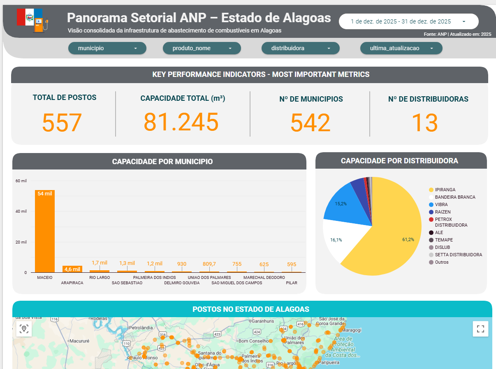
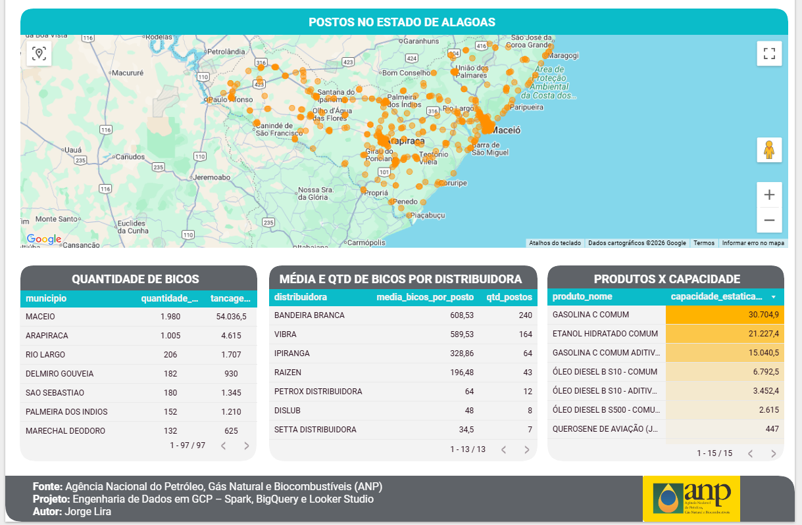

# Fuel Data Platform – ANP

Plataforma de dados para ingestão, processamento e análise de preços de combustíveis no Brasil, utilizando serviços gerenciados do Google Cloud Platform.

## Objetivo
Centralizar dados públicos da ANP, garantindo:
- Ingestão confiável
- Processamento escalável
- Dados analíticos prontos para consumo
- Controle de custo e qualidade

## Arquitetura
- Ingestão: Dataflow (Apache Beam)
- Storage: Google Cloud Storage (Parquet)
- Processamento: Spark (Dataproc)
- Orquestração: Cloud Composer (Airflow)
- Analytics: BigQuery

## Camadas de Dados
- **Bronze**: dados brutos da ANP
- **Silver**: dados limpos e normalizados
- **Gold**: métricas analíticas

## Status
Finalizado 

<h1 align="center">Panorama Setorial ANP – Estado de Alagoas</h1>

  
  

  <em>Visão consolidada da infraestrutura de abastecimento de combustíveis em Alagoas (ANP).</em>

## Lições Aprendidas (Engineering Notes)

### 1. Ambiente Reprodutível com Docker
Todo o ambiente de desenvolvimento é versionado via:
- `Dockerfile`
- `docker-compose.yml`
- `requirements.txt`

Benefícios:
- consistência entre dev / CI / produção  
- isolamento de dependências (Beam, Java, GCP SDK)  
- onboarding rápido

### 2. Diferença entre DirectRunner e DataflowRunner
- **DirectRunner**: execução local, utiliza credenciais do usuário
- **DataflowRunner**: execução distribuída, utiliza **Service Accounts**

Problemas de IAM e staging não aparecem no DirectRunner, mas surgem no DataflowRunner.

### 3. Simulação de Browser em Requisições de Worker
APIs governamentais (como a da ANP) frequentemente possuem firewalls ou filtros de segurança que bloqueiam User-Agents padrão de bibliotecas como requests ou urllib.

- **Problema:** O código funcionava no Swagger/Local mas retornava vazio (0 registros) no Dataflow.

- **Solução:** É obrigatório mimetizar os headers de um navegador real (User-Agent, Accept, Origin) dentro da DoFn. Sem o header Accept: application/json, a API pode simplesmente ignorar a requisição.

### 4. Paginação Baseada em Metadados (Pre-flight Request)
Evitar o "brute-force" de disparar milhares de requisições às cegas melhora a saúde do pipeline e reduz custos.

- **Técnica:** Realizar uma requisição síncrona inicial (fora do pipeline) para capturar metadados de paginação.

- **Aprendizado:** A ANP encapsula os controles de página no objeto searchPageFilter. Campos como totalPagina e totalRegistro devem ser usados para definir o range dinâmico do beam.Create .

### 5. Serialização e Escopo de Importação (Lazy Imports)
No Apache Beam, o código dentro de um DoFn é serializado e enviado para workers remotos.

- **Boas Práticas:** Importar bibliotecas pesadas (como requests) dentro do método process.

- **Por que:** Isso evita erros de NameError ou falhas de serialização caso o ambiente do worker tenha variações mínimas de instalação, garantindo que a dependência seja resolvida no momento da execução da tarefa.

### 6. Clusters Efêmeros e FinOps no Dataproc
Diferente de clusters persistentes, utilizamos a estratégia de Ephemeral Clusters para otimização de custos na GCP.

- **Configuração de Ciclo de Vida:** Implementação do parâmetro --max-idle, configurado no limite inferior permitido pela GCP (5 minutos). Isso garante que o hardware seja desalocado automaticamente logo após a conclusão do processamento.

- **Single Node vs Multi-node:** Para volumes de dados em fase de desenvolvimento ou transformações que não exigem shuffle massivo, o uso de Single Node elimina o overhead de comunicação de rede entre instâncias, reduzindo o custo por hora.

### 7. Processamento de Dados Semiestruturados (Explode Strategy)
O desafio técnico da Camada Silver foi converter o schema aninhado da ANP em uma estrutura tabular de alta performance.

- **Explode e Flatten:** O uso da função F.explode do PySpark permitiu transformar arrays de produtos em linhas individuais, garantindo granularidade para análises de tancagem e bicos.

- **Tratamento de Coordenadas:** Conversão de strings com separadores GEOGRAPHY para coordenadas.

### 8. Isolamento de Privilégios com Service Accounts Granulares
Seguindo o Princípio do Menor Privilégio, isolamos a identidade do Dataproc da identidade do Dataflow.

- **Role Customizada:** Criação de uma Service Account específica com a role roles/dataproc.worker e roles/storage.objectAdmin.

- **Segurança e Auditoria:** O isolamento permite identificar exatamente qual serviço realizou cada escrita no bucket e limita o raio de exposição em caso de falhas de segurança.

### 9. Arquitetura Lakehouse com Hive Partitioning
A integração entre o Cloud Storage (Data Lake) e o BigQuery (Data Warehouse) foi feita via Tabelas Externas.

- **Particionamento Físico:** Os dados foram salvos no GCS utilizando o padrão Hive (uf=XX/data_obtencao=YYYY-MM-DD/).

- **Pruning de Partição:** Esta estrutura permite que o BigQuery realize o "partition pruning", lendo apenas as pastas necessárias durante a consulta SQL, o que reduz drasticamente a latência e o custo de consulta.

- **Configuração via JSON:** O uso de arquivos de definição (def.json) com sourceUriPrefix foi necessário para que o BigQuery reconhecesse corretamente os metadados das pastas como colunas virtuais da tabela.

### 10. Camada Gold e Analytics de Valor
- **Business Logic:** Implementação de métricas de Market Share e capacidade instalada utilizando agregações temporais.

- **Serving Layer:** Disponibilização dos dados via BigQuery Views para consumo no Looker Studio, garantindo que o processamento pesado de joins e agregações ocorra na camada de dados, e não na visualização.

- **Métricas de Performance:** O uso de Views Gold permite reduzir o volume de dados escaneados em ferramentas de BI, otimizando o custo de consulta por usuário.

### 11. Visualização e BI (Looker Studio)
- **Dashboard Executivo:** Integração direta com a camada Gold do BigQuery.
- **Métricas Chave:** Monitorização de Market Share por Distribuidora, Capacidade de Armazenamento por UF e evolução temporal da base de postos.
- **Self-Service BI:** Utilização de filtros dinâmicos que aproveitam o particionamento do BigQuery para garantir consultas rápidas e de baixo custo.